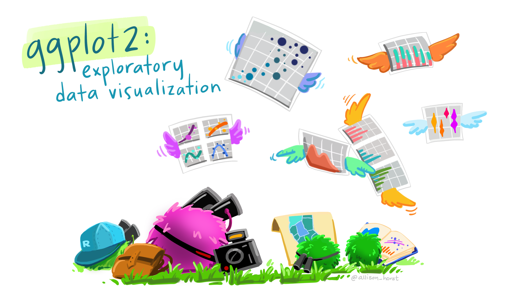
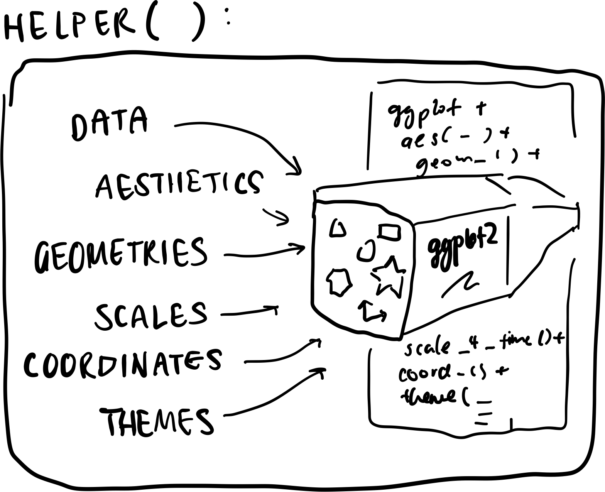
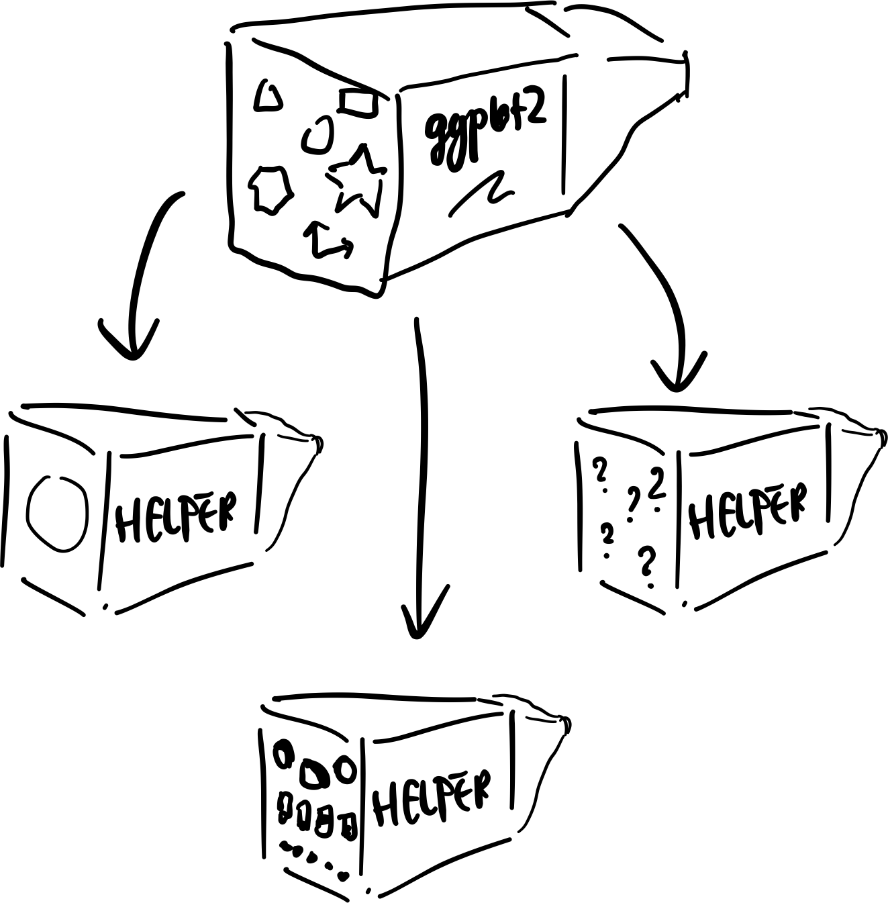

```{r}
#| eval: true
library(ggplot2)
library(palmerpenguins)
```

# Introduction

## About Me!

- 👩 Post-Doctoral Research Fellow at the Social Data and AI Lab with _Prof. Frauke Kreuter_, LMU Munich

- 📊 Research Interests
  - 🌰 "alternative" data for empirical social science research
  - 🤖 Leveraging LLMs and genAI in data wrangling and preparation
  - 🛠️ Tools for better data science -- including visualisation!

## About this talk

Based on:

- [Blog post: Design Principles for Plot Helper Functions](https://www.cynthiahqy.com/posts/ggplot-helper-design/)
- [Previous talk: Reusing ‘ggplot2’ code: how to design better plot helper functions, SSA-MelbURN Aug 2025](https://cynthiahqy.quarto.pub/ggplot-helpers-melburn-ssa-2025)

<!-- Accepted to:

- posit::conf(2026)
- UseR! 2026 -->

## Discussion Prompts

- Teaching students to reason about and write better functions -- [Nick Tierney, SLC-RUG October 2025 - Practical Functions, Practically Magic](https://www.youtube.com/watch?v=3ung7lp1seo)
- Quantifying the usability gain hypothesis
- Link to past discussions:
  - [ggplot2 extension packaging best practices workshop requirements #53](https://github.com/ggplot2-extenders/ggplot-extension-club/discussions/53)
  - how to design new ggproto objects
  - ggplot2 'exemplar' package idea from James Otto's talk


<!-- # Data Visualisation as Grammatical Constructs

## Have you heard of 'ggplot2'? 📊

::: {.smaller}

:::

## Grammar-based data visualisation

::: {.sketch-container}
{fig-align="center"}
:::

## Layered Grammar of Graphics ➕
::: {.columns}
::: {.column width="60%"}


:::
::: {.column .small .fragment width="40%"}

```{r}
#| echo: true
#| eval: true
#| code-line-numbers: "2|3-5|6|7|8"
#| output-location: fragment
ggplot(
  data = penguins, 
  mapping = aes(x = bill_length_mm,
                y = bill_depth_mm,
                color = species)) +
  geom_point() +
  theme_bw()
```

:::
:::


## But ggplot recipes can get long...

::: {.columns}
::: {.column}
::: {.smallest}
```{r}
#| eval: false
#| file: assets/example-ggtilecal-initial.R
#| echo: true
```

:::
:::
::: {.column}

::: {.fa-container}

:::

:::
:::


<!-- ## What if I just want to tweak it a little?

::: {.image-placeholder}
insert diff
::: --> 

# Ways to reuse ggplot code

## Copy & Paste

::: {.columns}
::: {.column}
```{r}
#| echo: true
#| eval: false
#| code-line-numbers: "|5,14"


ggplot(
  data = penguins, 
  mapping = aes(
    x = bill_length_mm,
    y = bill_depth_mm,
    color = species)) +
  geom_point()

## -- SPOT THE DIFFERENCE --

ggplot(
  data = penguins, 
  mapping = aes(
    x = bill_length_mm,
    y = flipper_length_mm,
    color = species)) +
  geom_point()
```
:::
::: {.column }
::: {.image-placeholder style="margin: 0;"}

:::
:::
:::


## Store layers as objects or in lists {auto-animate=true}

💡 Useful if components are exactly the same each time!

```{r}
#| echo: true
#| eval: true
#| output-location: column
#| code-line-numbers: "|3-8"
ggplot(mpg, aes(cty, hwy)) + 
  geom_point() + 
  geom_smooth(
  method = "lm", 
  se = FALSE, 
  colour = alpha("steelblue", 0.5),
  linewidth = 2
)
```
::: aside
Example from [_ggplot2: Elegant Graphics for Data Analysis (3e)_](https://ggplot2-book.org/programming.html#single-components)
:::

## Store layers as objects or in lists {auto-animate=true}

💡 Useful if components are exactly the same each time!

```{r}
#| echo: true
#| eval: true
#| output-location: column
#| code-line-numbers: "1-6|10"
bestfit <- 
geom_smooth(
  method = "lm", 
  se = FALSE, 
  colour = alpha("steelblue", 0.5),
  linewidth = 2
)
ggplot(mpg, aes(cty, hwy)) + 
  geom_point() + 
  bestfit
```

::: aside
Example from [_ggplot2: Elegant Graphics for Data Analysis (3e)_](https://ggplot2-book.org/programming.html#single-components)
:::

## Store layers as objects or **in lists** {visibility="hidden"}

```{.r}
geom_mean <- function() {
  list(
    stat_summary(fun = "mean", geom = "bar", fill = "grey70"),
    stat_summary(fun.data = "mean_cl_normal", geom = "errorbar", width = 0.4)
  )
}
ggplot(mpg, aes(class, cty)) + geom_mean()
ggplot(mpg, aes(drv, cty)) + geom_mean()
```
## Wrap it all into helper functions! 

::: {.sketch-container}
{fig-align="center" width="70%"}
:::

## Convenience vs. flexibility


::: {.columns}
::: {.column}

```{r}
#| echo: true
#| eval: true
#| output-location: fragment
library(ggweekly)
ggweek_planner(
  start_day = "2019-04-01", 
  end_day = "2019-06-30", 
)
```
:::
::: {.column .small .fragment}

What about customisation?

```{.r code-line-numbers="|11-13|14-16|18-20|17"}
ggweekly::ggweek_planner(
    start_day = lubridate::today(),
    end_day = start_day +
        lubridate::weeks(8) - lubridate::days(1),
    highlight_days = NULL,
    week_start = c("isoweek", "epiweek"),
    week_start_label = c("month day", "week", "none"),
    show_day_numbers = TRUE,
    show_month_start_day = TRUE,
    show_month_boundaries = TRUE,
    highlight_text_size = 2,
    month_text_size = 4,
    day_number_text_size = 2,
    month_color = "#f78154",
    day_number_color = "grey80",
    weekend_fill = "#f8f8f8",
    holidays = ggweekly::us_federal_holidays,
    font_base_family = "PT Sans",
    font_label_family = "PT Sans Narrow",
    font_label_text = NULL
)
```
:::
:::

::: aside
Example from [`github.com/gadenbuie/ggweekly`](https://github.com/gadenbuie/ggweekly)
:::

## Similar function, different wrapper?

::: {.columns}
::: {.column .small}
```{r}
#| echo: true
#| eval: true
#| output-location: default

# pak::pak("jayjacobs/ggcal")
library(ggcal)

mydate <- 
  seq(
    as.Date("2017-02-01"),
    as.Date("2017-07-22"),
    by="1 day")
myfills <- 
  rnorm(length(mydate))

print(ggcal(mydate, myfills))
```
:::
::: {.column .big .fragment}

* how many arguments does `ggcal()` have?
* what format should `dates`, `fills` be?

:::
:::

::: aside
Example from [`github.com/jayjacobs/ggcal`](https://github.com/jayjacobs/ggcal/)
:::

## Another helpful calendar maker?

::: {.columns}
::: {.column}
```{.r}
calendR(
    year = format(Sys.Date(), "%Y"),
    month = NULL,
    from = NULL,
    to = NULL,
    start = c("S", "M"),
    orientation = c("portrait", "landscape"),
    title,
    title.size = 20,
    title.col = "gray30",
    subtitle = "",
    subtitle.size = 10,
    subtitle.col = "gray30",
    text = NULL,
    text.pos = NULL,
    text.size = 4,
    text.col = "gray30",
    special.days = NULL,
    special.col = "gray90",
    gradient = FALSE,
    low.col = "white",
    col = "gray30",
    lwd = 0.5,
    lty = 1,
    font.family = "sans",
    font.style = "plain",
    day.size = 3,
    days.col = "gray30",
    weeknames,
    weeknames.col = "gray30",
    weeknames.size = 4.5,
    week.number = FALSE,
    week.number.col = "gray30",
    week.number.size = 8,
    monthnames,
    months.size = 10,
    months.col = "gray30",
    months.pos = 0.5,
    mbg.col = "white",
    legend.pos = "none",
    legend.title = "",
    bg.col = "white",
    bg.img = "",
    margin = 1,
    ncol,
    lunar = FALSE,
    lunar.col = "gray60",
    lunar.size = 7,
    pdf = FALSE,
    doc_name = "",
    papersize = "A4"
)
```
:::
::: {.column .big style="text-align: center"}
* Is this using ggplot2?
* What are the inputs?
* Internal data preparation?
* ...?
:::
:::

::: aside
Example from [`github.com/R-CoderDotCom/calendR`](https://github.com/R-CoderDotCom/calendR)
:::

## Beware false savings!
::: {columns}
::: {.column}

::: {.sketch-container}
{fig-align="center"}
:::
:::
::: {.column .fragment .big style="text-align: center"}
Sometimes 

**"saved" lines of code**

turn into

**confusing lists of plot specific arguments**
:::
:::

## Adding new grammar components?

::: {.columns}
::: {.column}

<iframe src="https://mjskay.github.io/ggdist/" width="100%" height="500px" style="border: 1px solid #ccc; border-radius: 8px;"></iframe>

:::
::: {.column .fragment}
Special data semantics need special handling:

  * time: `ggweekly`, `ggcal`, `CalendR`... `ggtime` (WIP)
  * variation & uncertainty: `ggdist`, [`ggdibbler`](https://harriet-mason.github.io/ggdibbler/articles/ggdibbler-vignette.html)
  * space: `sf`
:::
:::


# Plot (assembly) helpers

## Design goals
::: {.incremental .big}
* Quick 'autoplotting'
* Minimise plot-specific arguments
* Retain ggplot syntax & error messages
* Integrate well with other ggplot2 components
:::

## Solution {visibility="hidden"}

::: {.columns}
::: {.column}
::: {.image-placeholder}
Grammatical default inputs
:::
:::
::: {.column}
::: {.image-placeholder}
Modular internals
:::
:::
::: {.column}
::: {.image-placeholder}
Grammatical customisation
:::
:::
:::

## Case study: Interactive calendar!

::: {.columns}
::: {.column .smallest}
```{r}
#| eval: false
#| file: assets/example-ggtilecal-initial.R
#| echo: true
#| filename: very-long-ggplot-script.R
```

:::
::: {.column .small .incremental}

- data wrangling:
    - reshaping via `reframe()`
    - creating new variables
    - fill in missing days
    - calculating facet and layout (e.g. `Month`, `Month_week`)
- `ggplot2` components:
    - `scale`, `coord` and `facet` to layout the calendar
    - `theme` modification to style the plot as a calendar
    - interactive `geom` from `{ggiraph}`

:::
:::

## Convenient autoplotting

::: {.columns}
::: {.column}

<iframe src="https://cynthiahqy.github.io/ggtilecal/index.html" width="100%" height="500px" style="border: 1px solid #ccc; border-radius: 8px;"></iframe>

:::
::: {.column .fragment}

```{r}
#| output-location: fragment
#| echo: true
#| eval: true
#| code-line-numbers: "5-7"
library(ggtilecal)
dates <- make_empty_month_days(
  c("2024-01-05", "2024-06-30"))

gg_facet_wrap_months(
  dates,
  unit_date)
```

:::
:::


## ggplot lists as default inputs

::: {.columns}
::: {.column}

<iframe src="https://cynthiahqy.github.io/ggtilecal/index.html" width="100%" height="500px" style="border: 1px solid #ccc; border-radius: 8px;"></iframe>

:::
::: {.column .fragment}
```{.r code-line-numbers="1|1-5|6|6-9|10|10-19|20" filename="function-interface"}
gg_facet_wrap_months(
  ## --- data ----
  .events_long, 
  date_col,
  locale = NULL,
  ## --- facets / layout ----
  week_start = NULL, 
  nrow = NULL, 
  ncol = NULL,
  ## --- default layers ---
  .geom = list(
    geom_tile(color = "grey70", fill = "transparent"),
    geom_text(nudge_y = 0.25)
  ),
  .scale_coord = list(
    scale_y_reverse(),
    scale_x_discrete(position = "top"),
    coord_fixed(expand = TRUE)),
  .theme = list(theme_bw_tilecal()),
  .other = list()
)
```
:::
:::

## Modular internals

::: {.columns}
::: {.column style="align-items: start;"}

::: {.sketch-container style="margin: 0; align-items: start;"}

:::
:::
::: {.column .fragment}
```{.r code-line-numbers="1|2|2-5|7-8|9-15|16-19|1-22" filename="internals"}
gg_facet_wrap_months <- function(...){
  ## Data Helpers
  cal_data <- .events_long |>
    fill_missing_units({{ date_col }}) |>
    calc_calendar_vars({{ date_col }})

  ## Plot Construction
  base_plot <- cal_data |>
    ggplot2::ggplot(mapping = aes_string(
      x = "TC_wday_label",
      y = "TC_month_week",
      label = "TC_mday"
    )) +
    facet_wrap(c("TC_month_label"), axes = "all_x", nrow = nrow, ncol = ncol) +
    labs(y = NULL, x = NULL) +
    .geom +
    .scale_coord +
    .theme +
    .others

  base_plot
}
```
:::
:::

## Customising colours

<!-- TODO: get code animation to work -->

```{r}
#| echo: true
#| eval: true
#| output-location: slide
gg_facet_wrap_months(dates, unit_date,
    .geom = list(
      geom_tile(color = "grey70", fill = "transparent"),
      geom_text(nudge_y = 0.25),
    .theme = list(theme_bw_tilecal())
    )
)
```


## Customising colours

```{r}
#| echo: true
#| eval: true
#| code-line-numbers: "|5,8"
#| output-location: slide
gg_facet_wrap_months(dates, unit_date,
    .geom = list(
      geom_tile(color = "grey70", fill = "transparent"),
      geom_text(nudge_y = 0.25,
                color = "#6a329f")),
    .theme = list(theme_bw_tilecal(),
      theme(
        strip.background = element_rect(fill = "#d9d2e9")))
    )
```

## Adding interactivity

```{r}
#| echo: true
#| eval: true
#| code-line-numbers: "2,5-7|1,10|3,11-16"
#| output-location: slide

library(ggplot2)
library(ggtilecal)
library(ggiraph)

default_plot <- demo_events_gpt |>
    reframe_events(startDate, endDate) |>
    gg_facet_wrap_months(unit_date)

gi <- default_plot +
  geom_text(aes(label = event_emoji), nudge_y = -0.25, na.rm = TRUE) +
  geom_tile_interactive(
    aes(tooltip = paste(event_title),
        data_id = event_id),
    alpha = 0.2,
    fill = "transparent",
    colour = "grey80"
)

girafe(ggobj = gi)
```

## Supporting customisation

::: {.columns}
::: {.column}

<iframe src="https://cynthiahqy.github.io/ggtilecal/reference/gg_facet_wrap_months.html" width="100%" height="500px" style="border: 1px solid #ccc; border-radius: 8px;"></iframe>

:::
::: {.column .incremental}

**Explain:**

1. Data preparation steps
2. How the ggplot2 recipe works
3. How to modify the plot

:::
:::


## Design principles for plot helpers

::: {.columns}
::: {.column .incremental width="30%"}

1. **Expose** ggplot syntax & recipe
2. **Separate** functionality
3. **Document** grammatical customisation

:::
::: {.column .fragment width="70%"}

:::
:::

[_But remember **rules are made to be broken!**_]{.fragment}


<!-- - separate data transformation steps from ggplot construction
- expose as many components of the `ggplot2` recipe as possible
- minimise the number of plot-specfic arguments by using lists of components to accept ggplot2 customisation options
- explicitly document the internal workings of the helper function -->

## Thanks for Listening!
:::: {.columns}
::: {.column width="40%"}

{style="border-radius:50%" height="400px" fig-align="center"}
:::

::: {.column width="60%"}

**Find me at:**

- [cynthiahqy.com](https://cynthiahqy.com), 
- [\@cynthiahqy](https://www.linkedin.com/in/cynthiahqy/) and 
- *cynthiahqy[at]gmail.com*.

::: callout-tip

## Discussion Prompts

- Teaching functions
- Link to past ggextenders discussions:
  - best practices, exemplar package
- Testing 'how much better'?
:::
:::

::::

## Thanks for listening! {visibility="hidden"}

::: {.columns}
::: {.column}

{style="border-radius:50%" height="500px" fig-align="center"}

[_cynthiahqy.com_](cynthiahqy.com)


:::
::: {.column}
- 📝 [Design Principles for Plot Helper Functions](https://www.cynthiahqy.com/posts/ggplot-helper-design/)
- 📦 [ggtilecal](https://github.com/cynthiahqy/ggtilecal/)
- [Register for WOMBAT 2025!](https://wombat2025.numbat.space)
:::
:::

